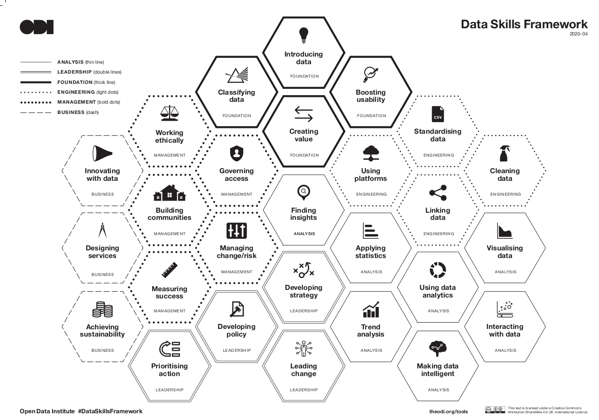

## Data Skills

## Data Manifestos

[Open Data Institutes Data Sharing Manifesto](https://theodi.org/article/engineering-data-for-the-public-good-a-manifesto)
[IceBreakerOne.org data sharing manifesto](https://icebreakerone.org/sharing-data-supporting-the-odi-manifesto/)

## Data Ownership

[Issues with Data Ownership](https://theodi.org/article/how-do-we-own-data/) - Nice article describing issues with data ownership

