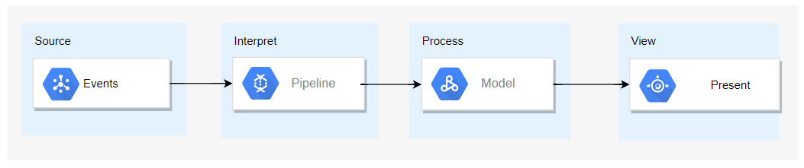

# Agenda Topics

Purpose of this description is not to convince you but rather to surface options from those considered to date.

## Solution Context 
### System
- Whats the system to be built
    - Logically something as simple as: 
- We will eventually have to realize it on top of infrastructure to make it accessible, resilient,....

###  Scope Quality Time Triangle

Where does this project sit on this triangle

- Scope - smallish
- Cost - smallish
- Time - shortish

### External Pressures
Where does the project sit in terms of complexification factors
- Quality - good enough
- Requirements stability - probably not signficant
- Prioritization - probably not a super high priority
- Time frame rigidity - probably some room for expansion

### Winning Hand
Commitment 
- Who are the resources committed to the project and what level of commitment do they have.
- Do people feel they are sufficiently committed to deliver this project

CoLocation
- Are the resource co-located?

Cohesion
- Do we see opporunities to break work down so there can be separate cohesive teams?

Team Size - 
- Is the team too big?  Do we have 2/3 teams
- Can we avoid Conway's law?
-  is the team small enough that overhead is minimized.

Skills -
- Do we have the skills to build the solution

Dependencies 
- What is out of our control

### Agile Principles
Are we happy with the agile principles

Be collaborative
Say what you will do & do what you say
Admit when you’re wrong
If you don’t know, ask
Say what you think but be respectful

Focus on what is valuable to the Customer
Optimise the product rather than your function
Understand where your tasks fits in

When things go wrong, focus on what was learned
Support others in their learning journey
Recognise that yours has not yet ended

### Representation
- Who represents the customer
- Who represents the end user
- Who represent who will operate the solution
- Who represents security perspective

Are these team concerns (agile and discussed during grooming) or role concerns (RACI)?

### Resources
- What resource (compute/storage) has been committed to this project
- Do people feel that sufficient compute/storage resource is committed to deliver this project

### IP

What is important from an IP perspective in this project
- data - Yes
- the service - Yes
- components source code - Probably Not
- service source code - Probably Not
- config - No

So it needs to incorporate authorized access?
So any source can be open source?

### Auditing
- Whats going to be important from an auditing perspective 
    - Any significant need to record
        - Who changed what and when

### Data Sensitivity
- Is the solution capturing sensitive data from multiple customers...Is there a need for data isolation?

## Solution - First Steps

###  Priorities

What are the 3 most important things to you in the way we work in this project and 
    - R1: risks if they dont happen
    - R2: risks in making it happen

For me:
- How we break work down
    - R1: overly complex individual components
    - R2: may spend more time searching for appropriate work breakdown only to find its wrong as we do the work
- Simplified Solution Core
    - R1: solution which is difficult to lifecycle/change  
    - R2: may be challenges to testing the presentation front end outside the browser
- Avoid excessive specialization, everyone can change everything
    - R1: bottlenecks and management overhead to develop the system
    - R2: risk that timeframes will get in the way of allowing this to happen.

### Explore,Exploit,Expand
Explore - Are there things we can try (for the first time) with this project
Expand - Are there things we can improve upon from previous projects
Exploit - Are there things we are doing well we can to further embed

Suggest 1-2 things you would like to see in Explore,Expand,Exploit for this project

From my perspective:
Explore - 
    System understandability - can we make the core of the system simple...so it can be easily understood, run, tested
    Higher Level Data Source - Firebase
Expand -
    DeckGL
    Red Green Refactor
Exploit - 
    Kanban
    GitLab
    Kubernetes

## Explore - One System Goal - System Understandability

System is understandable because
- we have source access for what we build and the 3rd party libraries we use to choose to use
- we can change/break the system and get feedback to this effect within seconds
- the dependencies/technology stack to run the system are easily installed on a developers machine and are independent of other project work
- no infrastructure is required to run the system (no external messaging, no external storage) 
- the development can be separated into core functionality and everything else

Proposal is we should strive to create the system core 
- independent of infrastructure
- completely testable
- easily understandable

Specifically describe the system core in a single process
where we can write tests that check for each event there is a corresponding change in view (a monad : presentation(state)=f(presentation(state),event)

We should have *end to end tests* for the system core that run in a unit tests. Separately we deploy the system core on top of infrastructure to acheive non functionals (resilience, accessability,...) 

*End to End* includes
- handling events
- interpreting events
- processing logic
- changes to presentation

#### Consequences
- there is no concept of front/end back end developer
- there is reduced need for separate test functionality....dev team should be responsible for quality rather than delegate
- all components must run together in a single process/language

### Capabilties
- CI - Any option other than GitLab 
- CD - Any option other than GitLab
- Publish and share solution parts/libraries so that the work can be delivered as a team.
    - Do we use services in the marketplace to share code artefacts
- Monitoring - 
    Is Kubernetes good enough?
- Centralized Logging - ?
- Backup - 

## Way of Working
Methodology Options
- Kanban
- Agile

- Do people know how to create stories, groom, and bring into development.
- Methodology Tool Options
    - Jira
    - Trello
    - GitLab
    - Monday.com

- Code Reviews

- Releasing 

## Work Break Down - Categories

Analytics – Science – Problem Formation
Story/Constraints – Elicitation – Problem Breakdown
Planning – Collaboration – Progressing Team Solutions

Access - Authentication and Authorization – Making a solution available

Integration – Standardization – Getting data from external systems
Infrastructure – Realization – Resource provisioning
DevOps – Automation – Efficient Change/Reducing SDLC cycle time

Dashboard – Presentation – Effective information display and control
Push – Notification – Pushing information to users

Forecasting  - Modelling – IO Functions
- Programmatic – System Development
- Rules Engine – Inferencing
- Training  - Machine Learning

API – Interfacing – Surfacing model behaviour
Pipelines – Composition – Joining information sources/streams

Warehousing - Data Life Cycling – What and how data is stored

Testing – Verification – Change with confidence
Operating - Monitoring
Supporting – Assisting

## Technical Topics

Cloud Choices
- GCP
- Azure

Storage Choices
- SQL
    - Postgres
    - SQL Server
- No SQL
    - Mongo
    - Firebase

UI Framework Choices
- React
- Vue
- Angular

Visualization Framework
- D3
- WebGL
- https://github.com/microsoft/SandDance

Dashboard Template Options
- https://flatlogic.com/
- https://coreui.io/

Environment Configuration - Managing the life cycle of configuration separate from that of code artefacts and data.

Project Generator
Archetype

