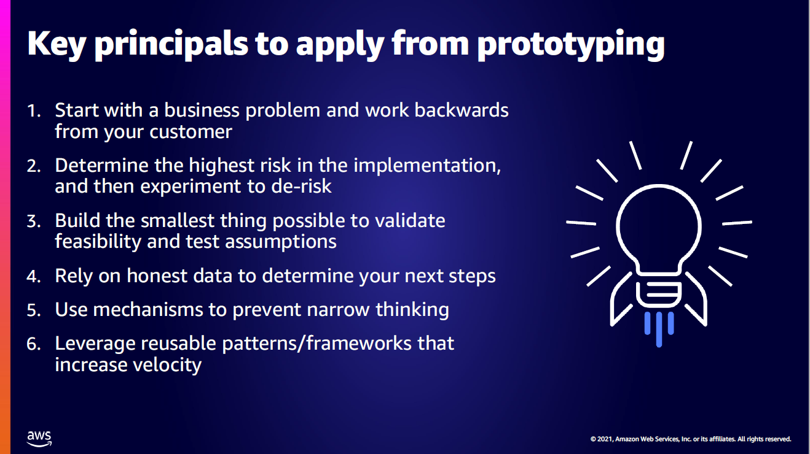

Work blocks
- End to End System
    - System is the inputs (events (user or data)) and past state) and outputs (events) relevant to the end user
    - Write unit tests for the end to end system , rather than intermediate parts.
    - Use Red Green Refactor
    - Exists in a single repository
    - system processes stream of events
- Packages
    - Can have unit tests
    - Exist in a single repository
- Adapters to infrastructure
    - integration to msging, db, api, UI, file upload
    - can exist in multiple repositories
    - low test coverage for flexibility

Considerations/Evaluating/Prioritizing Work Blocks
- Expect 5 iterations of each work block

